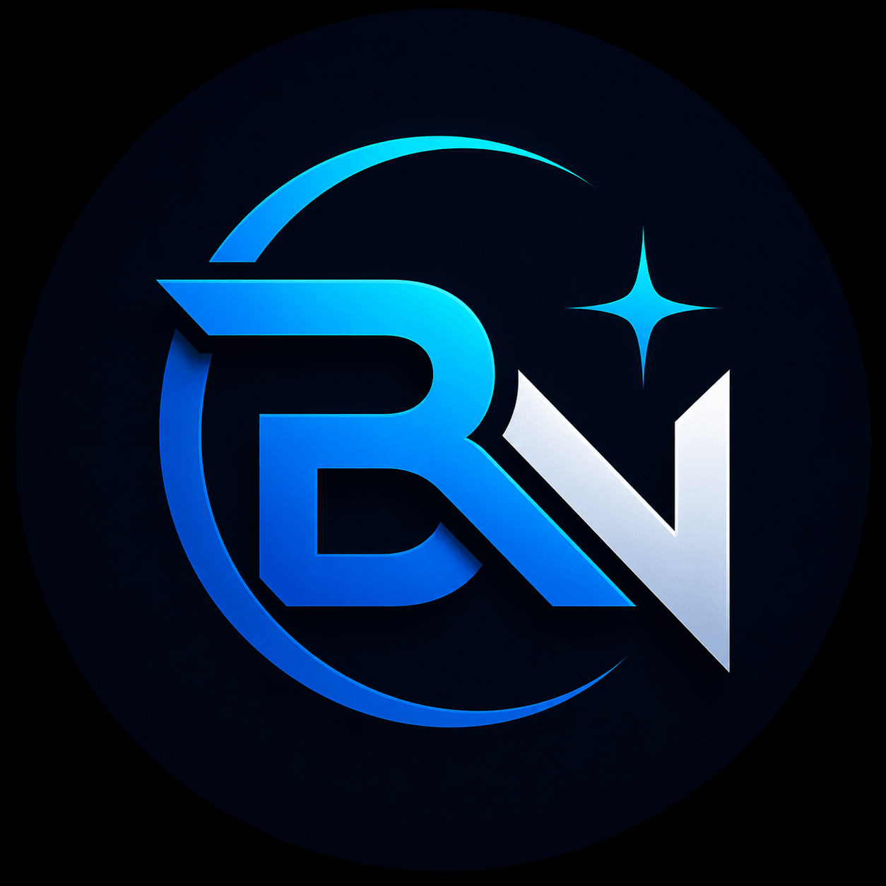

<div align="center">
  
</div>

<h1 align="center"><b>Hi, I'm BlueNova Studio</b> </h1>

Systems Engineering & Informatics Student.  
Currently learning and improving my knowledge in **frontend development, backend development, and software engineering**.  
Passionate about technology, programming, and building projects step by step.  

📍 From Peru 🇵🇪  

<h2>
  
  About Me
</h2>

- 🎓 Systems Engineering & Informatics Student  
- 💻 Future Web & Software Developer  
- 📚 Currently learning programming and software engineering  
- 🚀 Interested in frontend and backend technologies  
- 🛠️ Building projects and improving my coding skills step by step  

---

<h2> Skills</h2>

<p>Languages</p>
<span> 
  
  
  
  
  
  
  
  
</span>  

<h4>Tools & Technologies</h4>
<span>
  
  
  
</span>  

---

<h4>Contact</h4>
<p>
<a href="https://github.com/BlueNovaStudio" target="_blank"></a>
<a href="mailto:bluenovastudio.dev@gmail.com" target="_blank"></a>
</p>

---

<h2> GitHub Stats</h2>  

<div align="center">


</div>

---

<h2> Current Goals</h2>

- Build modern websites and applications  
- Improve frontend development skills  
- Learn backend technologies  
- Create software projects  
- Grow as a professional developer  

---

<h2> Quote</h2>

```txt
"Every expert was once a beginner."
```

---

<div align="center">

⭐ Thanks for visiting my profile ⭐

</div>
